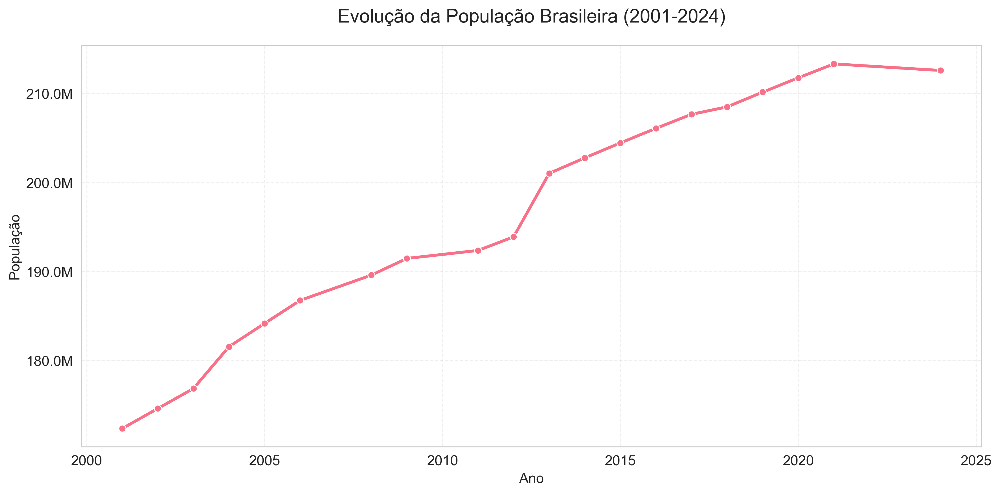
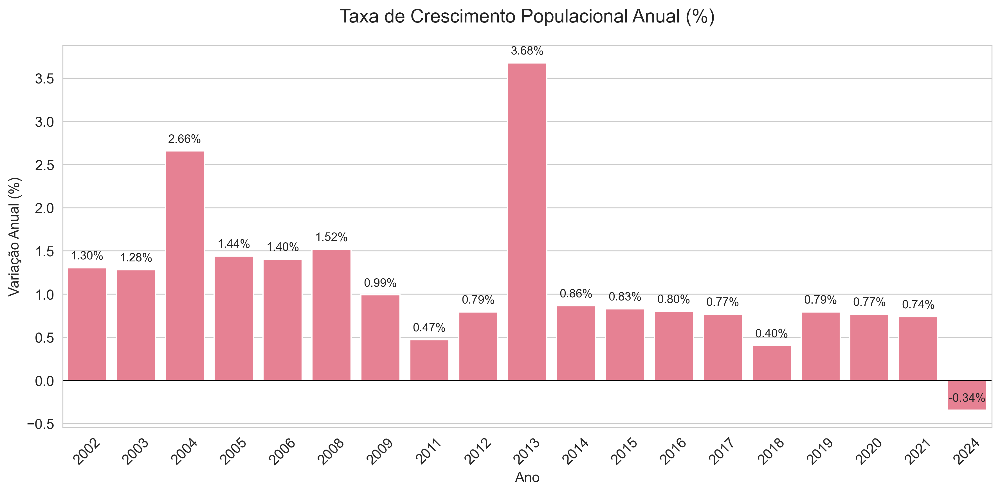
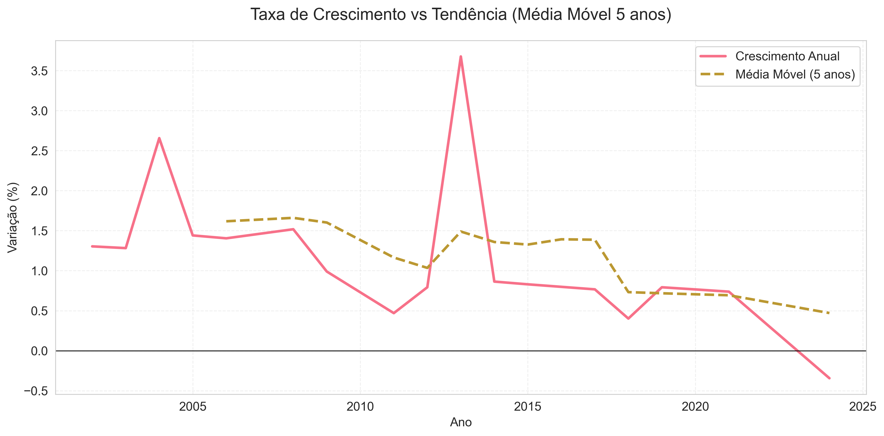

# Relatório de Análise Exploratória - População Brasileira

**Data da análise**: 15/05/2025 15:44

## Principais Métricas
- **População em 2001**: 172,385,826 habitantes
- **População em 2024**: 212,583,750 habitantes
- **Crescimento total (2001-2024)**: 23.32%
- **Taxa média anual de crescimento**: 1.11%
- **Ano com maior crescimento**: 2013.0 (3.68%)

## Visualizações

### Evolução Populacional

### Taxa de Crescimento Anual

### Tendência de Crescimento

